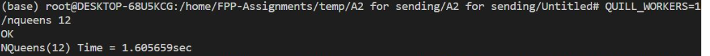
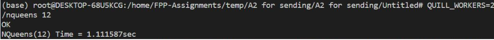
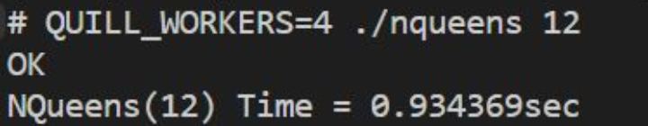
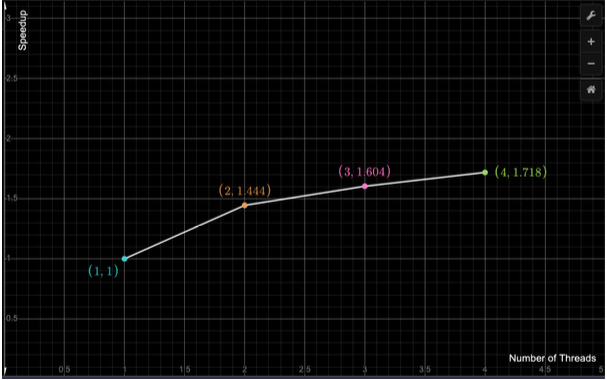

# QUILL

A light-weight work-stealing runtime for async-finish parallelism.

Implementation of a library based concurrency platform that supports async-finish parallelism.

### Supported APIs

- void async(std::function<void()> &&lambda)
- void start_finish()
- void end_finish()

### Usage

- Write the parallel program using simple async/finish parallel scopes.

- The parallelized code needs to be implemented as a lambda function in C++. Example usage in `nqueens.cpp` file.

- Build the library using this command:
`make quill-runtime.o libquill-runtime.so`

- Dynamically link the library using:
`g++ -std=c++11 program.cpp -o program -L. -lquill-runtime -lpthread`

where `program` is the name of the C++ file using the library functions.

## Results

The following are the screenshots for running of the program on 1, 2, 3 and
4 threads:

`Speedup = Tsequential/Tparallel`

Consider the case for execution on 1 thread: This is essentially the sequential
running of the NQueens program. So,
`Speedup = 1.605659/1.605659 = 1`

For 2 threads:

`Speedup = 1.605659/1.111587 = 1.4444744316009452`

For 3 threads:

`Speedup = 1.605659/1.00124 = 1.60372811135393`

For 4 threads:

`Speedup = 1.605659 = 1.7184420716012625 0.934369`

Plotting the graph:

From the above graph, we can see that the speedup for the given problem lies in the sublinear speedup range.

The speedup does not grow linearly as the number of threads increase. It’s slope begins to reduce to being less than 1. For each progressive thread, slope reduces even more.

The reason for the same is that the creation of threads also takes up a few thousand cycles of the CPU. Apart from that, we have used locks for the counter for the number of tasks, and for accessing the Deque for stealing and popping. These factors also stop the parallel program from achieving a linear speedup. The locks are used in the program to prevent data race conditions.